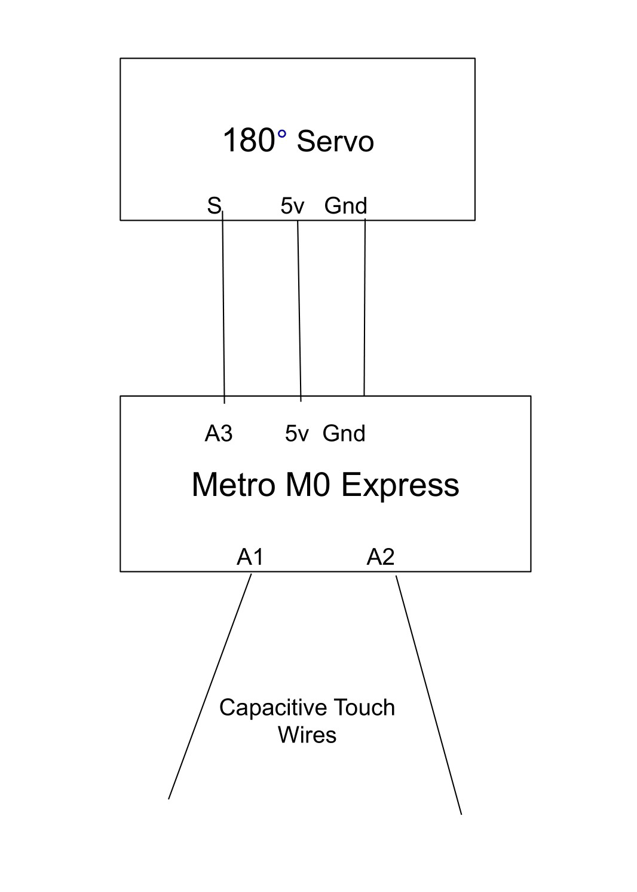

# CircuitPython

This is my repository for the introductory CircuitPython assignments.

---
## Table of Contents
* [Table of Contents](#Table-of-Contents)
* [Hello CircuitPython](#Hello-CircuitPython)
* [CircuitPython Servo](#CircuitPython-Servo)
* [CircuitPython LCD](#CircuitPython-LCD)

---

## Hello CircuitPython

### Description

In this assignment I got the Metro M0 Express board working, and coded a simple fade between green and blue with the built in LED.

### [Code](https://github.com/adent11/CircuitPython/blob/master/HelloCircuitPython.py)

``` python
import board
import neopixel
import time
x = 0
change = 1

dot = neopixel.NeoPixel(board.NEOPIXEL, 1)

while True:
    if x > 254:
        up = -1
    if x < 1:
        up = 1
    x += up
    dot.fill((0, -x+255, x))
    time.sleep(.1)
    print("Green Level: ", -x+255)
    print("Blue Level:", x)
```

### Reflection
At first I wasn't able to control the LED, but after updating the board [here](https://circuitpython.org/board/metro_m0_express/), and getting the correct library [here](https://circuitpython.org/libraries), it worked fine. I found it convenient that the Metro Express has a built in LED. While I was documenting this assignment in Github, I changed the name of the file from ```main.py``` to ```HelloCircuitPython.py```, which is what I am used to doing with Arduino code. After I did this, it stopped working, and the light was pulsing green. I found [this](https://learn.adafruit.com/adafruit-metro-m0-express-designed-for-circuitpython/troubleshooting) website which told me what the light meant, and found out [here](https://learn.adafruit.com/adafruit-metro-m0-express-designed-for-circuitpython/creating-and-editing-code) that it only runs files named ```code.py```, ```code.txt```, ```main.py```, or ```main.txt```.

---

## CircuitPython Servo

### Description
In this assignment I first got a servo to move back and forth, and then used capacative touch to control the movement of the servo based on touching wires.

### [Code](https://github.com/adent11/CircuitPython/blob/master/CircuitPythonServo.py)

``` python
while True:
    if touch1.value and not touch2.value and angle < 180:
        angle += 1
    if touch2.value and not touch1.value and angle > 0:
        angle -= 1
    print(angle)
    my_servo.angle = angle
    time.sleep(.01)
```
This code makes the servo turn to the counterclockwise when one wire is touched and clockwise when the other wire is touched.

### Wiring


 

### Reflection
In this assignment I made a couple simple mistakes that cost me a lot of time. On the Metro M0 Express servos use the analog pins to receive the signal telling them how to move, whereas on the Arduino they use digital. Also, since Python doens't use brackets for if statements, I found it easy to forget to put a colon. Other than that the servo and capacative touch parts of the code were fairly straightforward with the information from [this website](https://learn.adafruit.com/circuitpython-essentials/circuitpython-servo) for the servo and [this website](https://learn.adafruit.com/adafruit-metro-m0-express-designed-for-circuitpython/circuitpython-cap-touch) for capacative touch.

---

## CircuitPython LCD

### Description

In this assignment the goal was to use two buttons or capacative touch wires to change a value and the increment. One wire acted as a switch, changing the increment between -1 and 1, and the other wire adding the increment to a value. Both the increment and value are then printen on an LCD display.

### [Code](https://github.com/adent11/CircuitPython/blob/master/CircuitPythonLCD.py)

``` python
    lcd.clear()
    lcd.set_cursor_pos(0,0)
    lcd.print('Increment ' + str(change))
    lcd.set_cursor_pos(1,0)
    lcd.print('Value ' + str(value))
```

### Wiring

### Reflection
The LCD code functions the same way with CircuitPython as Arduino, just with different syntax. I faced two main challenges in printing the message to the LCD. The first was that before printing (or inside the print statement) you have to convert integers or other data types into strings using the ```str(x)``` function. The other was that I was limited in the amount of characters I could print to the LCD at a time. I solved this by shortening my message, but I could also have used a longer message that I only printed once, then only replace new characters.
